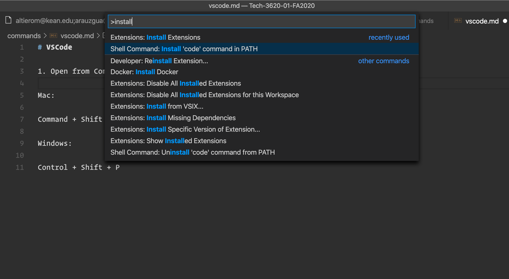

# VSCode

1. Open the Show Command Pallete

| Mac   | Windows   |
|---|---|
| Command + Shift + P   | Control + Shift + P |


2. Open VSCode from Command line by typing `code .`

    2a. Open the Show Command Pallete


```
Type `install` and look for `Install code command in PATH`.
```



